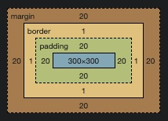

# Mock Frontend Interview Questions - Set 1

## 1. Trivia

### 1.1 Explain CSS box Model

<details>
  <summary>View answer</summary>
  
  ### 
  * The CSS box model is essentially a box that wraps around every HTML element. It consists of: margins, borders, paddings, and the actual content.
  * 
  * The main goal of asking this question is to see if the developer understands how the width and height of an HTML element is calculated on browser.
  * There are two types of CSS boxes: 
    * Content Box (Default) 
      * For a content box, the width and height property in CSS is applied to the content only. And the final width and height of element on DOM will be calculated as width and height of content + paddings + borders. Please note that margins are excluded.
      * You can set an element as content box using the rule `box-sizing: content-box`. But it is not required since it is the default setting.
    * Border Box:
      * For a border box, the width and height property in CSS is applied to everything inside the border. So, the final width and height of element on DOM will be the height and width set by you in CSS properties. Therefore it will include content + paddings + borders. Please note that margins are excluded.
      * You can set an element as border box using the rule `box-sizing: border-box`
      * This is a standard practice to use `box-sizing: border-box` for all the elements on your HTML.
      ```
      * {
        box-sizing: border-box;
      }
      ```      
  * [Code demonstration](01/css-box-model.html)
</details>
